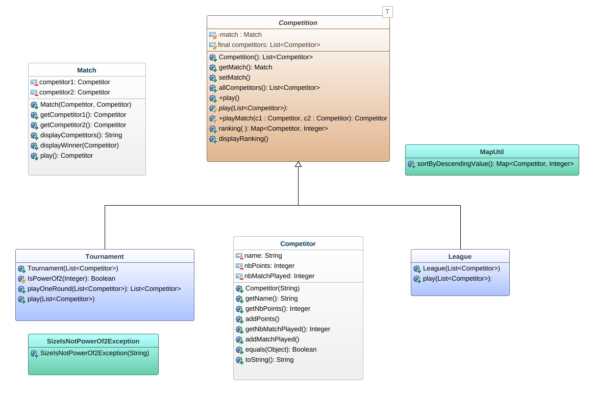
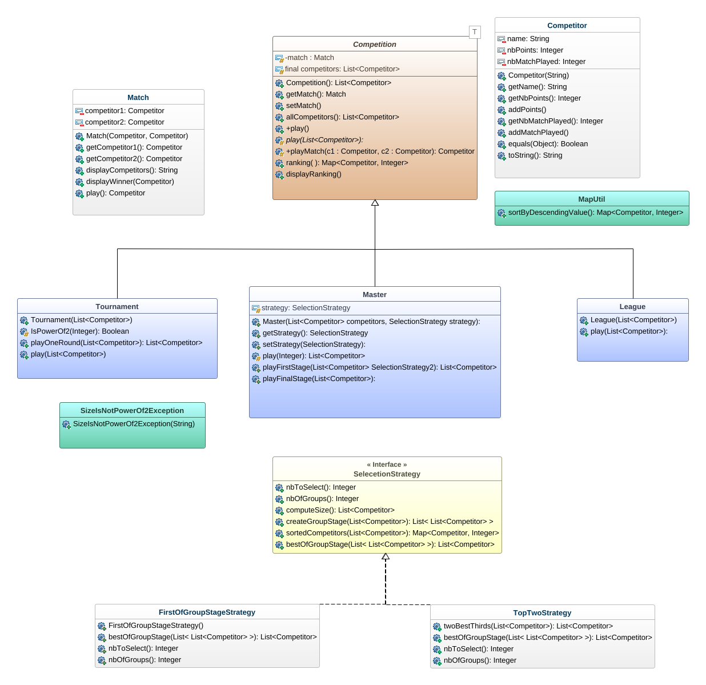
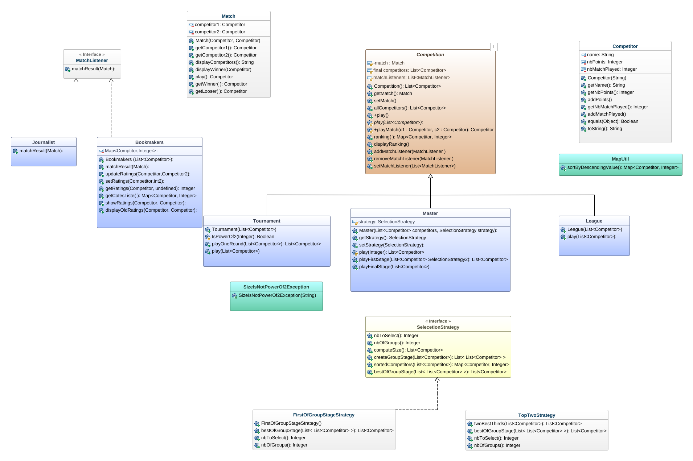
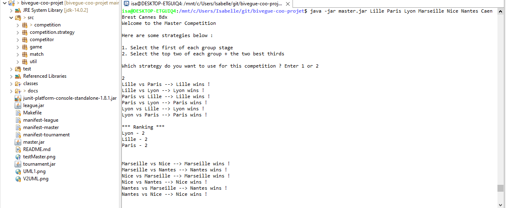
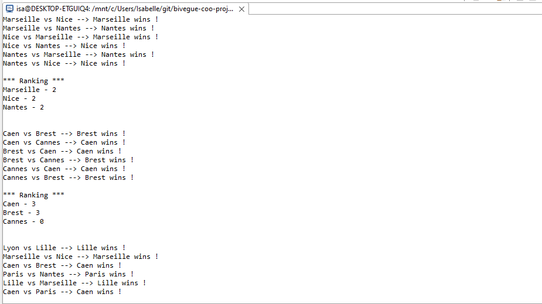
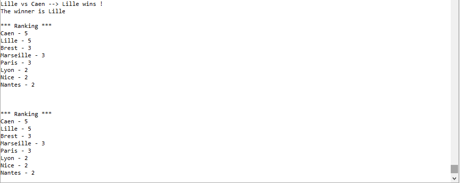
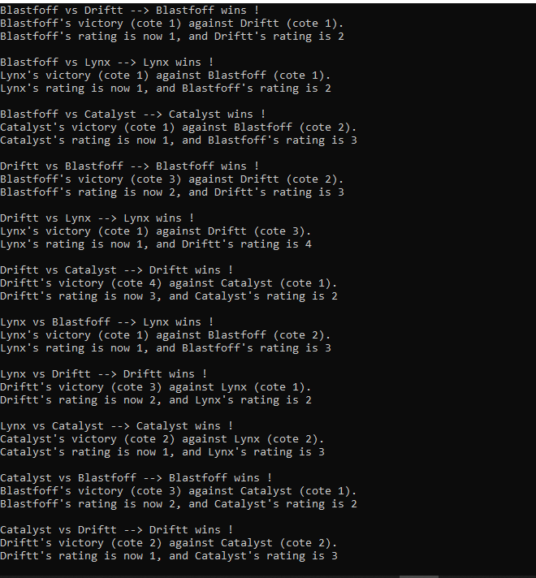
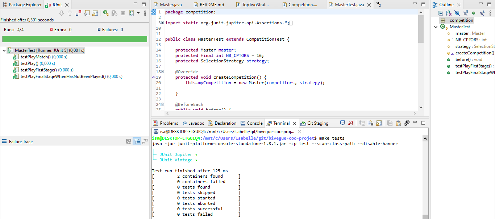

# Auteurs


**GACI Noufel**


# Introduction

Ce projet de conception consiste en l'implémentation de _compétitions sportives_ .

La première version est composée de deux types de compétitions : les _Championnats_ (matchs aller/retour) et les _Tournois_ (matchs à élimination directe). Selon les spécificités de chacune, des _compétiteurs_ s'affrontent lors de _matchs_. Le compétiteur ayant obtenu le plus de victoires sera déclaré vainqueur de la compétition.

Dans la deuxième version du projet, on s'intéresse à un nouveau type de compétition : les _Master_. Ils se déroulent en deux phases : la phase de poules et la phase finale ; et dépendent d'une stratégie qui permet de sélectionner les meilleurs compétiteurs pour jouer la phase finale.

La troisième version permet à des "observer" en l'occurrence les média et les parieurs d'assister aux macths d'une compétition. Les _Journalistes_ (média) assistent aux matchs et diffusent simplement les résultats de chacun d'entre eux tandis que les _Bookmakers_ (parieurs), en plus d'assister aux matchs, maintiennent une liste de cotes qu'ils feront évoluer en fonction des résultats des matchs.

Voici un lien vers le sujet du projet : [Compétitions Sportives](http://www.fil.univ-lille1.fr/%7Equinton/coo/projet/competitionsV3.pdf)


# HowTo

Ceci constitue une rubrique énonçant les principales commandes à exécuter pour lancer le projet.

Tout d'abord, faites un "clone" du projet, puis ouvrez un terminal, placez vous dans le dossier dans lequel vous souhaitez cloner le dépôt et entrez la commande

```sh
git clone LIEN_DU_GIT
```

 Dans le cas où le projet avait déjà été "cloné" auparavant, placez vous dans la racine du projet (toujours dans un terminal) et exécutez simplement la commande suivante :

```sh
git pull origin main
```
afin d'avoir la dernière version.

Une fois les instructions ci-dessus réalisées, placez vous dans le dossier contenant le _Makefile_ pour réaliser les prochaines commandes autrement, rien ne fonctionnera.

## Générer la documentation (javadoc)

Pour obtenir la documentation du projet, exécutez dans le terminal la commande :

```sh
make doc
```
Pour voir la documentation générée, ouvrez le dossier _docs_ puis ouvrez le fichier _index.html_ dans un navigateur.

## Compiler les classes

Pour compiler toutes les classes qui constituent ce projet, exécutez simplement la commande suivante :

```sh
make cls
```

## Tests

Pour compiler et exécuter les tests de ce projet, entrez simplement la commande suivante dans le terminal :

```sh
make tests
```

## Génerer une archive exécutable

* League : exécutez simplement la commande

```sh
make league.jar
```

* Tournament : exécutez simplement la commande

```sh
make tournament.jar
```
* Master : exécutez simplement la commande

```sh
make master.jar
```

## Exécuter le programme avec l'archive créée

Placez vous dans le dossier _jar_ et exécutez les commandes suivantes :

* Pour la ligue :

```sh
java -jar league.jar xxx
```

* Pour le tournois :

```sh
java -jar tournament.jar xxx
```
* Pour le Master :

```sh
java -jar master.jar xxx
```

NB : N'oubliez pas de remplacer _xxx_ par n'importe quel nom de votre choix pour lancer le programme.

## (Optionnel)

* Vous pouvez, si vous voulez, ignorer les trois premières instructions décrites ci-dessus et faire simplement

```sh
make all
```
dans votre terminal afin de générer la _documentation_, _compiler les classes_, _exécuter les tests_ et _créer l'archive exécutable_ le tout en une fois. Toutefois, la dernière instruction reste utile car, sans elle, il est impossible de lancer l'exécution de l'archive.

* Si vous souhaitez supprimer les dossiers _docs_ et _classes_, dans un terminal exécutez la commande

```sh
make clean
```


# Présentation d'éléments de code saillants

## Diagramme de classe associé au projet

### > Version 1.0

Ci-dessus, un bref aperçu des différentes classes implémentées.

* En rouge : sont représentées les _`classes abstraites`_ ;
* En bleu clair : sont représentées _`les classes filles`_ ;
* En blanc : les classes _`"simples"`_ ;
* En turquois : des classes _`"utilitaires"`_.



### > Version 2.0

Ci-dessous, une version à jour de l'UML pour définir notre Master

* En jaune : une _`interface`_.



### > Version 3.0

Une version à jour de l'UML pour modéliser les changements apportés pour la 3e version




## Eléments de conception

### > Version 1.0

* La classe `Competition` : est une classe  abstraite qui définit une compétition ainsi que le fonctionnement générale d'une compétition. Nous avons choisi de garder la méthode _play(List<Competitor>)_ comme abstraite, en fonction du type de compétition le déroulement n'est pas le même : il est donc difficile d'avoir un comportement prédéfini.


* La classe `Tournament` : ici, nous avons jugé indispensable d'avoir une méthode _playOneRound_ qui gère le déroulement d'un tour afin de faciliter l'implémentation de la méthode permettant de jouer tous les matchs du tournois.


* La classe `SizeIsNotPowerOf2Exception` : classe d'exception permettant de gérer le respect du nombre de compétiteurs nécessaire pour débuter un tournois.


* La classe `MapUtil` : classe utilitaire ayant pour responsabilité de gérer le tri des éléments d'une map dans l'ordre décroissant des valeurs (obligatoirement des entiers).

**_Pour les Tests :_**

* Utilisation de mock : nous avons choisi d'implémenter un mock de compétition pour la réalisation des tests de la classe Competition afin de vérifier que lors de l'exécution de la méthode _play()_ de competition la méthode _play(List<Competitor>)_ est bien appelée.


* Héritage de tests : nous avons également choisi de faire de l'héritage de tests pour la classe Competition et ses classes filles afin d'éviter la répétition de code pour les tests des différentes classes.

### > Version 2.0

* La classe `Master`: nous avons choisi de scinder le fonctionnement de la méthode _play()_ en deux étapes :
	- d'abord la première phase : gérée par la méthode **playFirstStage** qui permet de faire jouer la phase de poules de la compétition comme un _championnat_ en créant des poules en fonction de la stratégie de départ ;
	- ensuite la deuxième phase : jouée comme un _tournois_ et gérée par la méthode **playFinalStage** qui récupère les compétiteurs qui ont été selectionnés à l'issue de la phase précédente.

* L'interface `SelectionStrategy`: représente de façon générale les différentes stratégies de selection de compétiteurs et définit les messages acceptés par ces dernières.

**_Pour les Tests :_**

- `MockStrategy` : permet de définir une implémentation de l'interface `SelectionStrategy` ainsi qu'un comportement par "défaut" pour la méthode _bestOfGroupStage_. Cette implémentation facilite également la réalisation des tests unitaires de la classe `Master` dépendant d'une stratégie.

- L'héritage de tests ici montre que la classe `MasterTest` passe avec succès ses propres tests en plus de celles de la classe mère `CompetitionTest`.

### > Version 3.0

**_Pour les tests :_**

- `MockListener` : fournit une implémentation par défaut de `MatchListener` notamment pour la méthode _matchResult_, ce qui nous permettra de s'assurer que la méthode est correctement appelée dans la méthode _playMatch_ de la classe `Competition`.


## Principes de conception mis en oeuvre

### > Version 1.0

* Single Responsibility Principle : nous pensons avoir appliqué ce principe en particulier dans les classes Competition, Tournament et Match.
	- Dans la classe Match, au lieu d'avoir une méthode qui permet à la fois de jouer un match, désigner un vainqueur et afficher le vainqueur, nous avons découpé ces responsabilités en différentes méthodes afin d'obtenir : une méthode pour jouer un match, une pour désigner un vainqueur ainsi qu'une pour afficher le vainqueur ;
	- Dans la classe Tournament, il y a une méthode permettant de vérifier qu'un entier est une puissance de deux, une pour dérouler un tour dans le tournois et enfin une pour dérouler tout le tournois.

Il est important de noter qu'avec ce principe, nous avons des méthodes moins longues, donc plus lisible et facilitant la compréhension.


* Open Close Principle : la première version de notre projet est faite de sorte que plus tard on puisse éventuellement rajouter par exemple d'autres types de compétitions, matchs ou compétiteurs en se servant du squelette déjà défini sans avoir à modifier du code.


* Design Patterns -> _Template Method_ : la classe abstraite _Competition_ définit une méthode concerète `play()` qui lègue aux sous-classes la définition du comportement de la méthode `play(List<Competitor>)` sans qu'elles ne changent la structure de l'algorithme.

### > Version 2.0

* Dependency Inversion Principle : la classe _Master_ ne dépend pas directement d'une classe définissant une stratégie mais plutôt de l'interface _SelectionStrategy_. Cette inversion de dépendance lui permet de s'adapter à n'importe quelle stratégie et surtout de ne pas violer de Open Close Principle.

* Design Patterns -> _Strategy_ : `SelectionStrategy` permet de définir différentes manières de sélectionner des compétiteurs.

### > Version 3.0

* Single Responsibility Principle : dans la classe `Bookmakers`, nous avons séparé le contrat de la méthode _matchResult_ en 3 responsabilités différentes :
	1. afficher les anciennes cotes des compétiteurs en même temps que le résultat du match ,
	2. mettre à jour les cotes des des compétiteurs :  la méthode _updateRatings_ a elle-même été décomposée de telle sorte qu'elle se contente uniquement de mettre à jour les cotes pendant qu'une autre méthode (_setRatings_) se charge de faire le calcul.
	3. afficher les nouvelles cotes.

* Design Patterns -> _Observer_ :
	- `MatchListener` définit l'interface implémentée par les classes réceptrices ;
	- `Match`, implantée depuis la première version, représente ici la classe des évènements auxquels vont _<< s'abonner >> _ les classes réceptrices.
	- `Competition`, également implantée depuis la première version, fait office de classe _<< génératrice >>_ des évènements. Elle se charge de "notifier" les classes réceptrices à chaque fois qu'un match (l'évènement) a lieu. ,


# Exemple sur l'exécution du programmee

## > Programmee

### > Version 2.0

Un exemple de trace d'exécution de la classe MasterMain :

)

)

)


### > Version 3.0

Un exemple d'exécution pour troisième version du projet.



## > Tests

Ci-dessous, un exemple de la bonne exécution des tests de la classe `MasterTest` :

)


NB : Nous n'avons pas trouvé comment créer un jar exécutable pour les tests. En se documentant sur le site de JUnit5, nous avons trouvé une archive permettant de lancer l'exécution de tests depuis le terminal, c'est donc cette archive que vous trouvez dans le dépôt.
